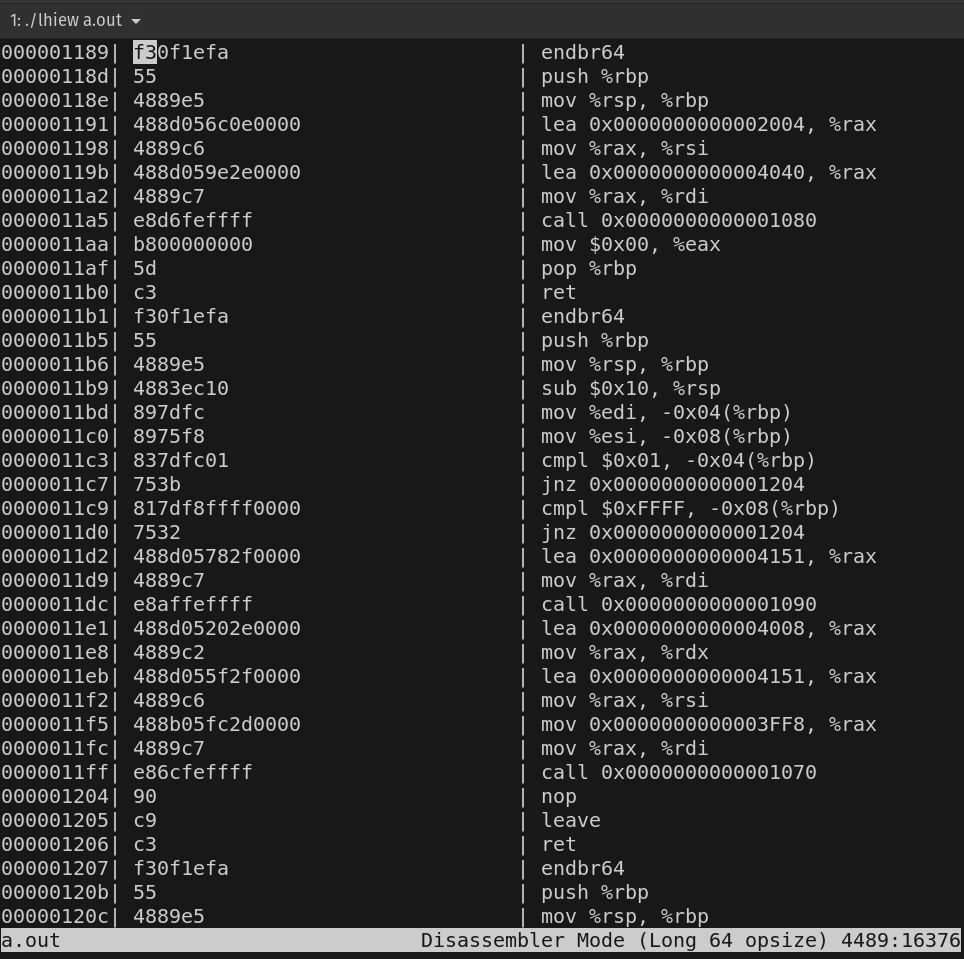

# LHiew

Linux clone of [hiew editor](https://www.hiew.ru/) which can view binary files in raw, hex or dissasembly mode.


[](src/LICENSE)

</div>

<details open="open">
<summary>Table of Contents</summary>

- [About](##about)
- [Getting Started](#getting-started)
    - [Usage](###Usage)
        - [Open file](####Open file)
        - [Keybindings](####Keybindings)
- [Installing](##Installing)
  - [Requirments](#####Requirments)
  - [Compilling from source](#####Compilling from source)
- [License](#license)
- [Acknowledgements](#acknowledgements)

</details>

---

## About
**LHiew** is a console editor, Linux clone of well-know editor Hiew. Amongst its feature set is its ability to view files in text, hex and disassembly mode in which A&T syntax is used.


## Getting Started

### Usage

#### Open file

You could open binary file to view
```sh
lhiew ./a.out
```




#### Keybindings

| Key Combination    | Action                                 |
|--------------------|----------------------------------------|
| `Ctrl-q`           | Quit                                   |
| `Ctrl-m`           | Toggle previous mode                   |
| `m`                | Toggle next mode                       |
| `o`                | Change between assembly operator sizes |
| `h`, `Left Arrow`  | Move cursor left                       |
| `k`, `Up Arrow`    | Move cursor up                         |
| `j`, `Down Arrow`  | Move cursor down                       |
| `l`, `Right Arrow` | Move cursor right                      |
| `PgUp`             | Move cursor up on screen               |
| `PgDn`             | Move cursor down on screen             |

Supported assembly operator sizes are the following: 
- 64 bit mode;
- 32 bit protected mode;
- 16 bit protected mode;
- real mode.

#### Installing

##### Requirments
1. CMake 3.0 or higher
2. compiler that supports C11

##### Compilling from source

Please follow these steps for manual setup:

1. [Clone the code](https://github.com/dec0dOS/amazing-github-template/releases/download/latest/) using `git clone --recursive git@github.com:andreitsy/lhiew.git`
2. Create directory with build `cd lhiew && mkdir build`
3. Run `cd build && cmake ..`
4. Run `make`

## License

This project is licensed under the **MIT license**. Feel free to edit and distribute this template as you like.

See [LICENSE](src/LICENSE) for more information.

## Acknowledgements

Thanks for this awesome resources that were used during the development:

- https://viewsourcecode.org/snaptoken/kilo/
- https://www.hiew.ru/
- https://github.com/zyantific/zydis
