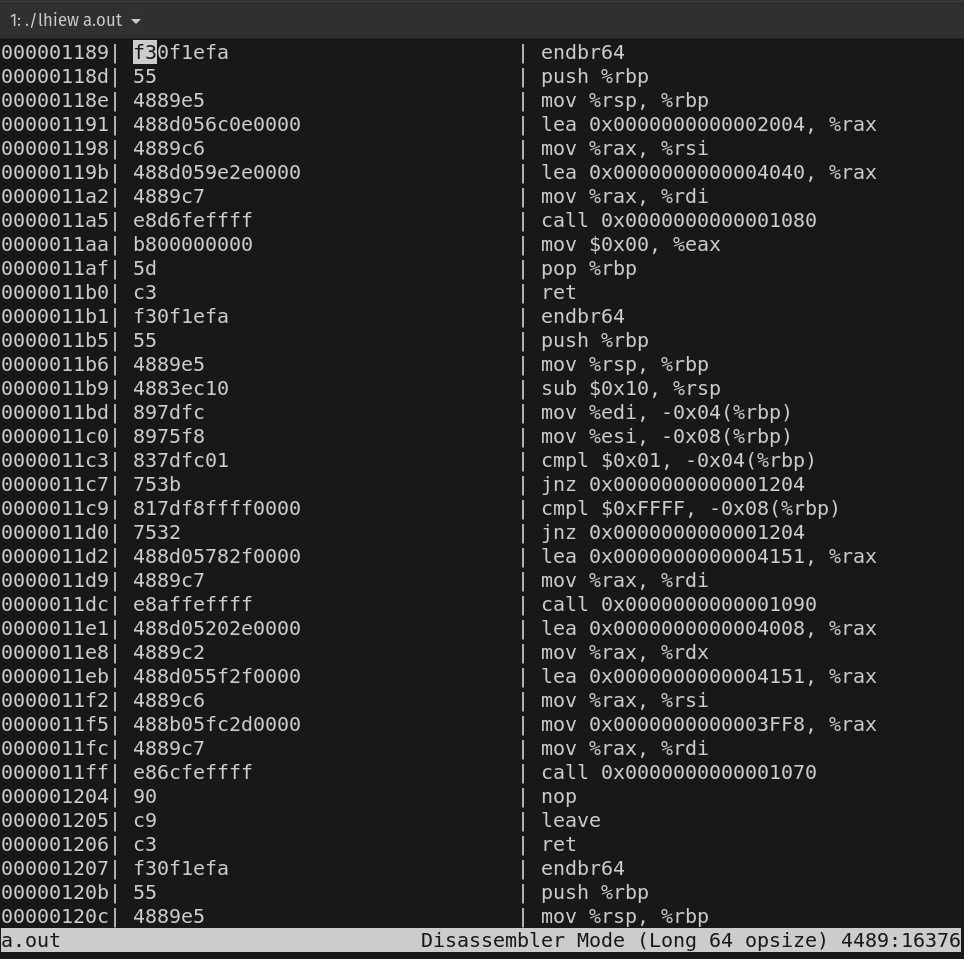
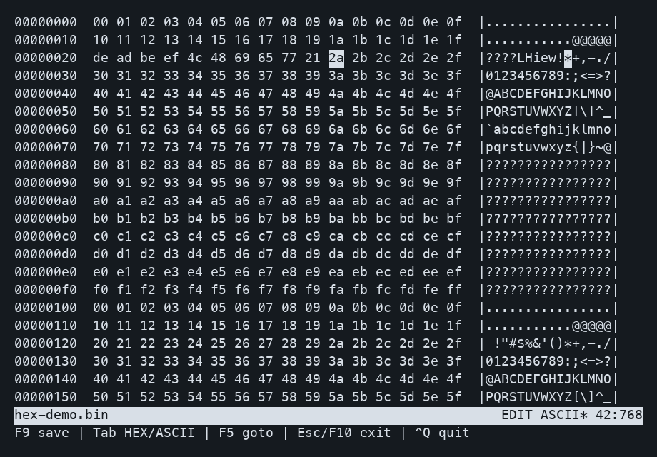
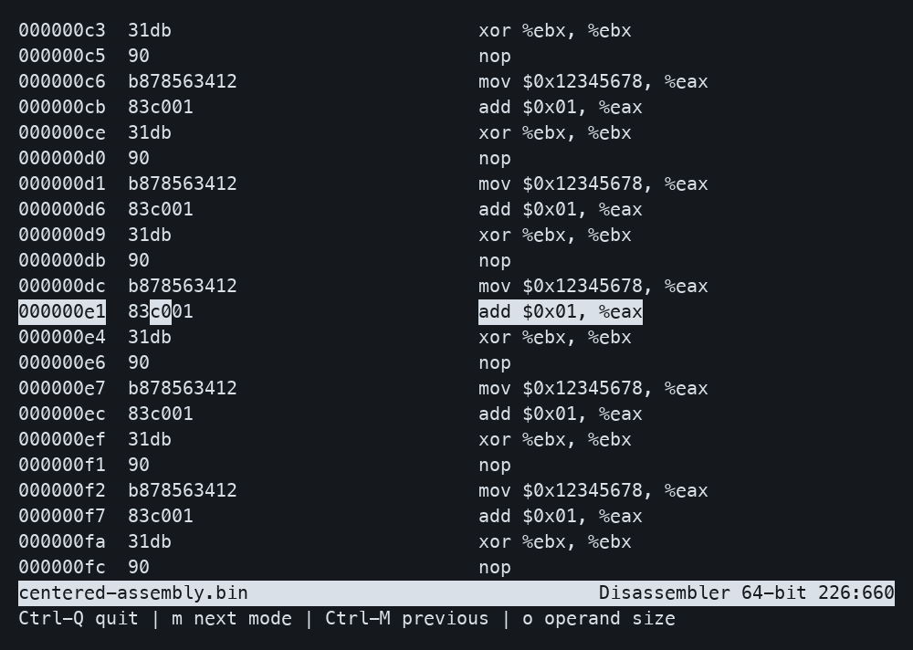
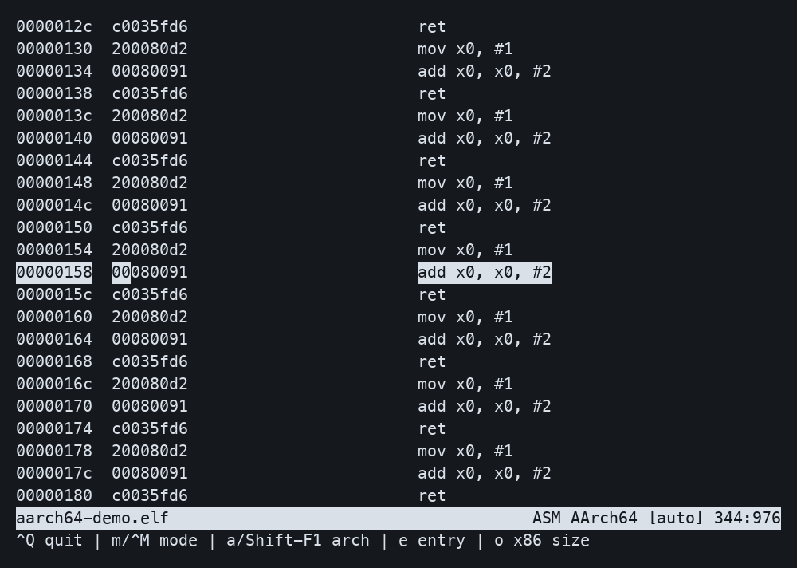
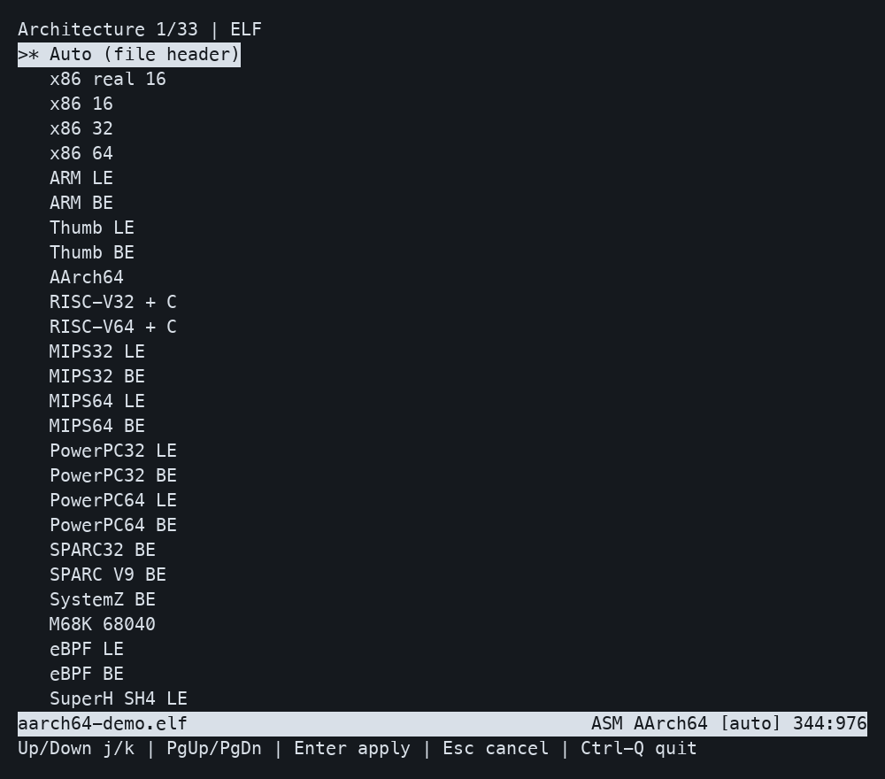

# LHiew

Linux terminal binary viewer and hex editor inspired by [Hiew](https://www.hiew.ru/),
with text, hex and multiarchitecture disassembly views.


[](LICENSE)

<details open="open">
<summary>Table of Contents</summary>

- [About](#about)
- [Getting Started](#getting-started)
    - [Usage](#usage)
    - [Keybindings](#keybindings)
- [Installing](#installing)
  - [Requirements](#requirements)
  - [Compiling from source](#compiling-from-source)
- [Development and validation](docs/development.md)
- [License](#license)
- [Acknowledgements](#acknowledgements)

</details>

---

## About
**LHiew** views binary files and overwrites existing bytes through hex or ASCII
input. Changes stay private until explicitly saved. It detects CPU architecture
from supported executable headers and displays assembly using Zydis for x86
(AT&T syntax) and Capstone for other CPUs. An executable browser exposes
PE, NE, LE, LX and i386 NLM headers/regions and existing import names/ordinals.


## Getting Started

### Usage

#### Open file

Open an existing binary file:
```sh
lhiew ./a.out
```



#### Edit existing bytes

Press **F3** from any view to enter the hex editor. Press **F5**, enter an absolute
**hexadecimal file offset**, and press Enter to jump there. Type two hex digits
per byte; **Tab** switches between hex and printable ASCII input. Use arrows,
Page Up/Down, Home/End, or Ctrl-Home/Ctrl-End to navigate while editing.

**F9** saves changed bytes and keeps the editor open. **Escape/F10** leave editing
in hex view; **Ctrl-Q** quits. With unsaved changes, choose **`s` save**, **`d`
discard**, or **Escape continue**. While editing, printable keys are file input;
leave the editor before using view shortcuts such as `m` or `a`.



Editing overwrites bytes without changing file length. There is no application
file-size cap, but the file must fit the platform's file-offset types and virtual
address space. Only changed bytes are written on save. Nonempty regular files
must be writable to enter editing; read-only files can still be viewed.
Before enabling edits, LHiew creates **`<filename>.backup`**. The first backup is
preserved across saves and later sessions; it is never replaced automatically.
Backup failure blocks editing. Sparse files are copied without allocating the
whole file in memory.

Insertion/deletion, file creation, an assembler, and general undo are not
implemented. See the [editing walkthrough, save behavior, and limits](docs/hex-editing.md),
including the mapping to the historical Hiew workflow.

#### Browse and edit executable imports

Press **F8** (or **`b`** while viewing) to open imports. **Tab** switches between
imports and headers/regions. Arrows and Page Up/Down move the selection;
**Enter** opens the selected record's bytes in hex view.

Select an editable module, function name or ordinal and press **F3**. **Ctrl-U**
clears the current value; enter its replacement and press **Enter** to stage it.
Names must keep their original byte length, and ordinals must fit their existing
field. **F9** saves; **Escape** closes the browser, preserving pending edits.
The ordinary editor's save/discard prompt still applies when leaving editing.

Support covers standard **PE32/PE32+** imports, **NE/LE/LX** import fixups and
primary **i386 NLM v4** external references. Bound PE imports and LE/LX imports
with fixup checksums are browse-only. Adding imports, resizing tables, exports,
PE delay-import decoding and automatic checksum/signature repair remain outside
this feature. See the [format coverage and workflow](docs/executable-imports.md).


#### Terminal sizes

LHiew follows the terminal's current width and height and redraws automatically
when you resize it, preserving the selected byte. The minimum usable size is
**24 columns by 5 rows**. Smaller windows show a resize message; enlarge the
window to resume. `Ctrl-q` quits, with an unsaved-changes prompt when needed.

Text wraps to the available width. Hex mode adjusts the number of bytes per
row and keeps offsets, hex values, and ASCII aligned. Narrow disassembly views
prioritize offsets and instructions, adding the raw instruction bytes when
space permits. Long instructions are marked with `~` when truncated.
The status and help bars also adapt to the available width.

Disassembly keeps the selected instruction near the middle of the screen,
with preceding instructions above it when available. `PgUp` and `PgDn` move
by one screen of instructions; text and hex modes move by one screen of rows.



#### Architectures and executable files

Open an ELF, PE/PE32+, TE, DOS MZ, i386 NLM v4 or thin Mach-O file and switch to disassembly
with `m` twice or `Ctrl-M`. From offset zero, the view moves to the detected
entry point, or the first executable region when no mapped entry is available.
Press `e` to return there. Decoders receive mapped runtime addresses; native
relative operand syntax (such as RISC-V branch displacements) is preserved.
The left column and cursor still use file offsets.
NLM has runtime-assigned load bases, so its decoder addresses remain file offsets.

The main desktop/mobile targets are **x86 16/32/64, ARM/Thumb, AArch64, and
RISC-V 32/64**, including compressed RISC-V instructions. Additional profiles
cover MIPS, PowerPC, SPARC, SystemZ, M68K, eBPF, SuperH, TriCore, XCore,
TMS320C64x, Motorola 6809 and MOS 6502.



Use **Shift-F1** or **`a`** to choose a CPU manually. Navigate with arrows,
`j`/`k`, Page Up/Down or Home/End; Enter applies and Escape cancels. **Auto (file header)**
restores automatic detection. Raw files default to x86-32 and need a manual
choice for other CPUs; changing the architecture preserves the selected byte.



Support is limited to the listed decoder profiles. NE/LE/LX have the import and
header browser above, but still need manual architecture selection for decoding.
Universal Mach-O, hybrid PE machine types and unsupported CPUs need further
support; malformed headers are reported. Mixed ARM/Thumb code may need manual
selection. Architecture selection changes decoding; it does not assemble
instruction text. Existing instruction bytes can be patched in the hex editor.
See the
[architecture analysis, implementation plan and limitations](docs/architectures.md)
and the updated [feature comparison](FEATURES.md).

#### Tests and sample binaries

After building, run `ctest --test-dir build --output-on-failure`. Unit tests cover
file loading, backups, hex/import editing and saving, executable tables,
disassembly, rendering, cursor boundaries, and resizing. Sparse-file editing and
backup checks exercise offsets beyond 4 GiB. When
Python 3 is available, CTest also verifies the binary fixtures and drives the
application through a pseudo-terminal to test live resizing and keyboard input.
The same suite runs under strict warnings, aggressive Release optimization, and
address/undefined-behavior sanitizers; see [development and validation](docs/development.md).

The reproducible [binary fixtures](tests/fixtures/README.md) include 16-, 32-,
and 64-bit x86 code, a minimal Linux ELF executable, and empty or malformed
instruction streams. For example, open `./build/lhiew tests/fixtures/raw_x86_64.bin`,
press `m` twice for disassembly, then `o` once to select 64-bit decoding.

The [architecture fixtures](tests/architecture_fixtures/README.md) cover every
exposed CPU profile with reproducible files and expected instruction sequences.
For an automatically detected example, open
`./build/lhiew tests/architecture_fixtures/elf_aarch64.bin` and press `Ctrl-M`.


#### Keybindings

| Key Combination    | Action                                 |
|--------------------|----------------------------------------|
| `Ctrl-q`           | Quit; prompt if edits are unsaved      |
| `Ctrl-m`           | Previous view outside editing          |
| `m`                | Next view outside editing              |
| `F3`               | Enter hex editing from any view        |
| `F5`               | Goto absolute hexadecimal file offset  |
| `g`                | Goto offset while viewing              |
| `F7`, view-mode `s` | Find hexadecimal bytes or literal text |
| `Shift-F7`         | Repeat search in the recorded direction |
| view-mode `n`, `N` | Repeat search forward/backward         |
| `F8`, view-mode `b` | Open executable imports/header browser |
| `Tab`              | Switch hex/ASCII input while editing   |
| `F9`               | Save changed bytes; remain editing     |
| `Escape`, `F10`    | Leave editing; prompt if unsaved        |
| `o`                | Cycle x86 decoding mode                |
| `Shift-F1`, `a`    | Select architecture or restore Auto    |
| `e`                | View entry / first executable region   |
| `Left Arrow`       | Move cursor left                       |
| `Up Arrow`         | Move cursor up                         |
| `Down Arrow`       | Move cursor down                       |
| `Right Arrow`      | Move cursor right                      |
| `PgUp`             | Move up one screen                     |
| `PgDn`             | Move down one screen                   |
| `Home`, `End`      | First/last byte in current row          |
| `Ctrl-Home`, `Ctrl-End` | First/last existing file byte      |

The `h/j/k/l` movement keys and architecture/view shortcuts apply while viewing.
Printable characters are input while editing. At the unsaved-edits prompt,
`s` saves, `d` discards pending changes, and Escape returns to editing.
Within the executable browser, Tab changes the table, F3 edits the selected
import, Enter jumps to its bytes, and Escape returns to the underlying view.
Within search, Tab switches hex/text input, Ctrl-U clears, Enter searches, and
Escape cancels. Patterns contain at most 64 bytes. Searches start at the cursor
and do not wrap; repeats move in the selected direction. Search also sees pending
edits; use F7 during editing.

Supported x86 decoding modes are:
- 64 bit mode;
- 32 bit protected mode;
- 16 bit protected mode;
- real mode.

## Installing

### Requirements
1. CMake 3.21 or higher
2. GCC or Clang with C17 support
3. Git submodules initialized for Zydis and Capstone
4. Python 3 (optional; enables fixture checks and terminal integration tests)

### Compiling from source

Please follow these steps for manual setup:

```sh
git clone --recursive git@github.com:andreitsy/lhiew.git
cd lhiew
git submodule update --init --recursive
cmake -S . -B build -DCMAKE_BUILD_TYPE=Release
cmake --build build --parallel
ctest --test-dir build --output-on-failure
```

Release enables GCC `-Ofast`, or Clang's equivalent
`-O3 -ffast-math -fstrict-aliasing`. Warnings are errors for LHiew and its C tests.
For Debug, sanitizers, or standards-preserving Release optimization, see
[the build options](docs/development.md#build-and-test).

## License

This project is licensed under the **MIT license**.

See [LICENSE](LICENSE) for more information.

## Acknowledgements

Resources used during development:

- https://viewsourcecode.org/snaptoken/kilo/
- https://www.hiew.ru/
- https://github.com/zyantific/zydis
- https://github.com/capstone-engine/capstone
