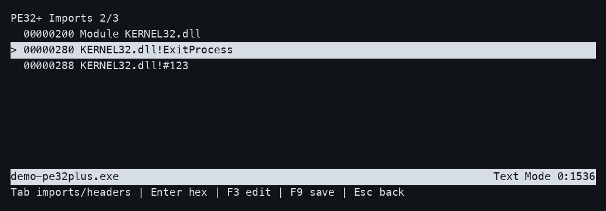

# Executable headers and import editing

LHiew can browse **PE32/PE32+, NE, LE, LX and i386 NLM v4** files and edit
existing import names and ordinals in place. It reads file bytes; it does not
load or execute the inspected program or its dependencies.

Names retain their exact byte length, ordinal fields retain their width, and
the file keeps its original size. Adding/removing imports, moving tables,
converting name imports to ordinal imports, exports, and general structured
header editing are not implemented.

## Reachable workflow

1. Open an existing executable with `./build/lhiew /path/to/file`.
2. Press **F8**, or **`b`** while viewing, to open **Imports**.
3. Use arrows, **`j`/`k`**, **Page Up/Down**, or **Home/End** to select a row.
   **Tab** switches between **Imports** and **Headers/regions**. Offsets in the
   browser are hexadecimal file offsets.
4. **Enter** opens the selected record or region in hex view. Use F8 to reopen
   the browser. Region rows represent the underlying file data or table record;
   they do not uniformly represent runtime addresses.
5. Select an editable module, function name or ordinal and press **F3**. LHiew
   secures `<filename>.backup` before enabling edits. **Ctrl-U** clears the
   current value; Backspace removes its last character. Type the replacement.
6. Press **Enter** to stage the change. A name must have exactly the original
   number of bytes; an ordinal is decimal and must fit the existing field.
   Invalid input leaves the original field unchanged. Input accepts printable
   ASCII; use the raw hex editor when working with other name encodings.
7. **F9** saves staged bytes and keeps the browser open. **Escape** cancels an
   active field prompt; otherwise it closes the browser without discarding
   staged changes. Once back in hex editing, Escape/F10 or Ctrl-Q use the normal
   save/discard/continue handling when changes remain.

While editing bytes, use F8: `b` is ordinary byte input in the hex/ASCII editor.
Opening the browser without editing requires no write permission. Malformed,
unsupported or inspection-limit results disable structured editing; any
displayed partial rows are for inspection only.



Import-name storage can be shared by multiple records. Editing a shared name
updates every reference to those same bytes; the browser reparses after the edit.
LHiew does not verify whether a replacement symbol exists in a target module.

## Format coverage

| Format | Browsing and existing-field edits | Limits |
|---|---|---|
| PE32 / PE32+ | Header summary, sections, module names, standard import-by-name and import-by-ordinal records; equal-length names and 16-bit ordinal values | Bound imports are browse-only; inconsistent or overlapping metadata is not editable; no export browser |
| NE | Header, segments, module references and per-segment imported names/ordinals, including additive fixups; 16-bit ordinal fields | Windows self-loading modules are unsupported; standard ordered name/entry tables required; iterated segments stay encoded |
| LE / LX | Header, object records, module names and external name/ordinal fixups, including source lists and additive forms; existing 8/16/32-bit ordinal fields | Little-endian format level 0 only; nonzero fixup checksum makes imports read-only; overloaded procedure names and entry-table forwarders are not decoded |
| NLM | Primary i386 v4 header, code/data images, module dependencies and global imported symbols | Other versions/CPUs and shared-image import extensions are unsupported; imports have global names, not per-symbol DLL associations |

For unbound PE ordinal imports, the lookup table and matching import-address
table are changed together. Existing encoding flag bits are retained. If a
bound PE has no independent lookup table, symbol names/ordinals cannot be
recovered from its resolved addresses and are not invented. PE delay imports
are not decoded; a valid delay-directory row allows inspection of its raw bytes.

NE segment rows jump to encoded segment bytes, or the segment descriptor when
no file data exists. LE/LX object rows show address/size/flags/page information
and jump to their **24-byte object descriptor**, not to reconstructed code.
Neither browser expands compressed or iterated pages or applies relocations.
NE/LE/LX browsing is independent of automatic CPU detection; choose a decoding
profile manually for those formats.

i386 NLM v4 also supports automatic x86-32 detection, entry navigation and
separate code/data boundaries. NLM runtime load bases are assigned by the loader,
so disassembly addresses use file offsets. The dependency table and the global
symbol table are separate; a listed dependency is not a claimed owner of every
imported symbol.

Checksums, executable signatures, binding metadata and export-name databases
are not regenerated. Structured edits are restricted where existing binding or
fixup checksums require coordinated changes; raw hex editing remains available.
This feature does not claim that arbitrary renaming produces a loadable program.

## Backups and save behavior

Before enabling any hex or import edit, LHiew creates **`<filename>.backup`**.
The first independent regular backup is preserved across saves and later
sessions, even when the source has since changed. It is never overwritten
automatically. To choose a new baseline, explicitly archive or remove that
backup yourself before starting another editing session.

A new backup is copied with bounded memory, preserving sparse holes where
possible. The copy is flushed, published without overwriting an existing path,
and its containing directory is flushed before editing begins. Source changes,
copy/publish/flush failures, a symlink/nonregular backup, or a backup alias of the
source prevent editing. The copy preserves bytes, not all file metadata; there
is no restore command.

Edits use the existing private mapping and remain pending until F9. Save writes
changed bytes and flushes them. A failed save can leave partial changes on disk;
discard reloads disk contents and does not roll those writes back. The original
backup remains available. See [hex editing and recovery limits](hex-editing.md#storage-conflicts-and-limits).

## Fixtures and verification

Generate disposable examples and open one:

```sh
python3 tests/import_fixtures.py /tmp/lhiew-import-examples
./build/lhiew /tmp/lhiew-import-examples/pe32.bin
```

The [fixture generator](../tests/import_fixtures.py) supplies examples for PE32,
PE32+, NE, LE, LX and NLM.
The parser tests serialize independent records and exercise malformed spans,
record boundaries, counts, fixup encodings and unsupported forms. Parsers share
unaligned endian readers and overflow-safe span checks; automatic detection and
the browser share NLM variable-header validation. PE overlap checks sort copies
of section intervals, preserving the displayed section order.
[Terminal tests](../tests/test_executable_browser.py)
follow the visible browse → edit → save → reopen path for each format, together
with cancellation, backup protection, key handling and resizing. Backup tests
also cover sparse files beyond 4 GiB and failed-copy cleanup.

Run `ctest --test-dir build --output-on-failure`; repeat with the
[Release and sanitizer configurations](development.md#build-and-test). These targeted fixtures do not
establish compatibility with every historical linker or executable variant.

## Format references

- [Microsoft PE/COFF specification](https://learn.microsoft.com/en-us/windows/win32/debug/pe-format)
  defines standard import lookup/address tables and ordinal encodings.
- [Open Watcom NE definitions](https://raw.githubusercontent.com/open-watcom/open-watcom-v2/master/bld/watcom/h/exeos2.h)
  and [Wine's NE segment loader](https://raw.githubusercontent.com/wine-mirror/wine/master/dlls/krnl386.exe16/ne_segment.c)
  describe segment and import relocation records.
- [IBM LX format reference](https://komh.github.io/os2books/os2tk45/lxref.htm)
  and [Open Watcom LE/LX definitions](https://github.com/open-watcom/open-watcom-v2/blob/master/bld/watcom/h/exeflat.h)
  describe module/procedure tables and variable fixup encodings.
- [Open Watcom NLM definitions](https://raw.githubusercontent.com/open-watcom/open-watcom-v2/master/bld/watcom/h/exenov.h),
  [NLM writer](https://raw.githubusercontent.com/open-watcom/open-watcom-v2/master/bld/wl/c/loadnov.c)
  and [GNU BFD i386 NLM decoder](https://gnu.googlesource.com/binutils-gdb/%2B/refs/heads/gdb_7_3-branch/bfd/nlm32-i386.c)
  document the primary header, counted names and relocation-reference encoding.

The [historical Hiew 6.03 article](http://unicornix.spb.ru/docs/prog/heap/hiew.htm)
motivated this workflow. Its claim of uniqueness is not adopted as a current
comparison, and support here is limited to the formats and operations above.
